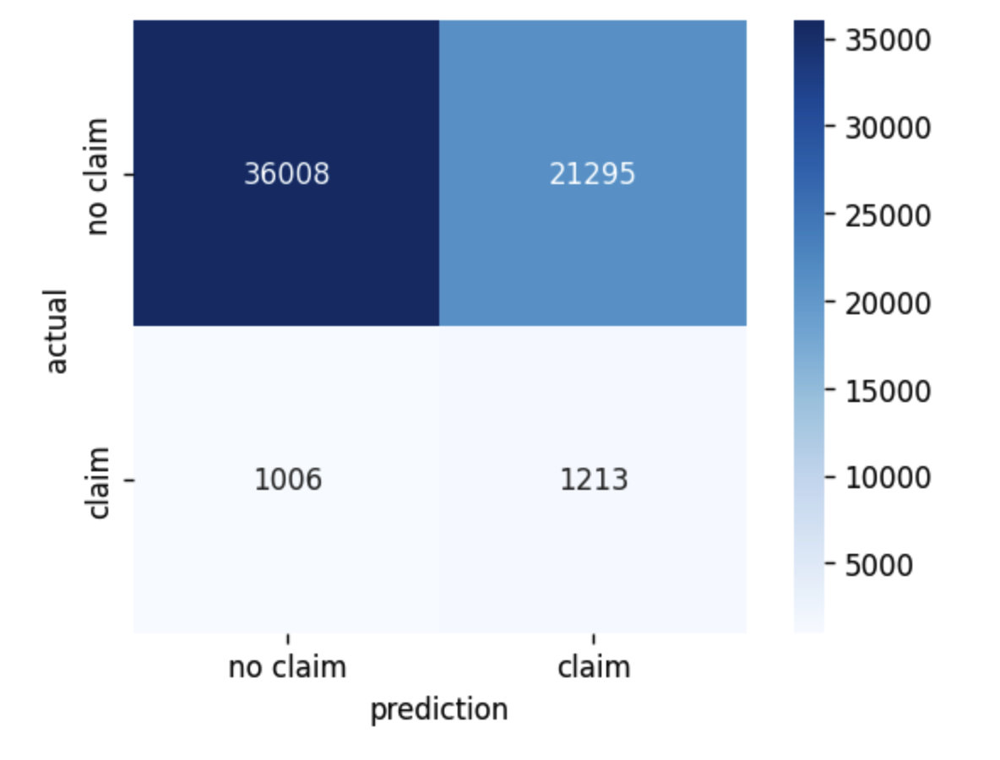

# Classification Project MVP

## Car Insurance Claim Prediction

### Goal: 
  - Predicting the probability that a driver will initiate a car insurance claim in the next year.

### Data: 
  - Porto Seguro, a large Brazilian car insurance company, provided a relatively large, real commercial dataset to Kaggle as part of a competition a few years ago. 
  - The training data they provided has 595,212 datapoints, one per driver per year, each with 57 features; plus a binary target value denoting whether or not a claim was submitted by that driver. 
  - The data is unbalanced with 21,694 (3.64%) of the datapoints showing a claim.

### Assumptions:
  - I assume the average cost of a claim is significantly more that the average price of a premium.
  - So a false negative is significantly more expensive for the company than a false positive: i.e. failing to predict a claim is much worse than predicting a claim will occur when it doesn't.
  - As a result recall is a particularly important metric for this problem.

### MVP findings:
  - The diagram below shows a confusion matrix on held-out data for a logistic regression model with balanced class weights, with default decision threshold of 0.5. 
  - A recall score of 0.547, an F1 score of 0.096 and ROC AUC of 0.623 demonstrate the difficulty of predicting claims in this data with logistic regression
  - Nevertheless even as it is, this model could prove financially beneficial to the company. For example the company can divide it's customers into low and high risk groups: using the figures from the diagram below such group members would have a 2.79% and 5.69% average chance of making a claim respectively.

### Next steps:
- It will be interesting to see if other types of model, such as decision trees and random forest, can improve prediction.
- It will also be worth trying to varying the decision threshold amongst other hyperparameters, and using class rebalancing techniques, on whichever model or models seem most promising.

